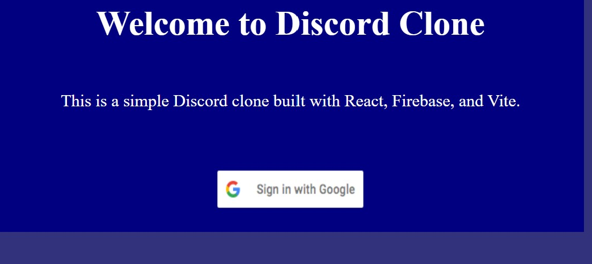
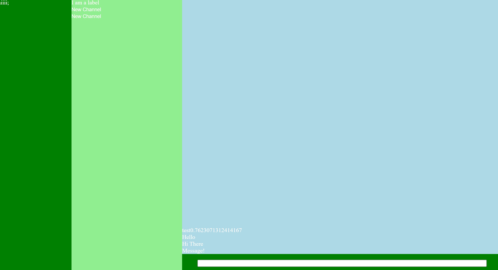

# Project 2 Proposal
Team: Gregory Del Bene, Shane Wierl
We will be creating a clone of discord as it a prototypical example of a SPA. We both have a moderate interest in the technology behind chatroom applications and are curious about trying to recreate it from scratch. The intended audience will be anyone looking for like-minded communication clusters on the internet--i.e., the audience for forums. All of this will be styled differently from discord. Our inspiration from them was their chatroom structure. We made a very basic wireframe , based on Discord, and is shown in Pictures below
Minimum Viable Product - A chatroom app that can read and write data to Firebase, and store servers to messages. We also want to style it to look somewhat professional.
Stretch Goals - Full UI set up, and Real Time Updates to the chatrooms. Be able to delete, create, rename servers.
# Project 2 WIP Check In

### Forked Repository For Complete Refactor Process
https://github.com/shwi6838/Web-Dev-Project-2

We started with a plan for the components, seeing what we needs to use and create. We wanted to use Firebase's Database, but we needed a good hierarchy to start with. We used our knowledge of Discord, and created one. 

Servers -> Server
                -> Category -> Channel
                                     -> Messages

Then we made a static repesentation of the App, and make a Firebase Account to set up. There was trouble with refactoring to components, so we decided to try a class based approach, with Servers, Categories/Channels, and Messages in that hierarchy. Gregory has a great computer science c/c++ background so he has set up those classes. I made a basic welcome screen, and found out that Google Authentification hasn't been consistent lately because of browsers updating to automatically block third party cookies, so we will have to find some other authentification. We are thinking of creating our own user / password system. 

Using Firestore Databases, we can use realtime updating databases to store messages and servers, and plan on integrating that fetching system, to save live messages and allow for us to search for servers. The Data we are needing to change is going to be Servers, as we can add or delete servers. This will include the rest of their children, the categories, channels, and messages. We can store all of these in arrays and update with State or Class objects. Since it is in Firebase, they will handle the realtime changes, and we can use UseEffect(), when a server is created, or when channels are created, or when messages or created to call the Firebase APIs.

I also plan to find a UI kit that we can use and customize for our components for a clear and good looking User Experience of the app, and to intorduce myself to these UI frameworks that work with React. We will not make an exact Discord clone, but make our own similar chatroom app and style it in our own way. 

## Pictures /Documentation
Welcome Page Version 1

App Page Version 1

ChatRoom Version 1

# Project 2 Reflection

Overall we hit our goals, and created an app we are proud of. The backend functionality and structure took most of our time, but we got it to work. We had to do a full revamp of the app to meet React expectations and structures, so I had to make a new repository to essentially rewrite the project. This proved to be easier than we expected. I (shane) would've liked to have spent more time styling, maybe using an UI Kit for react / javascript. Overall we both had a fair contribution, as Greg worked mainly on the backend and base prototype, I set up our Firebase account , and I helped Greg rewrite his code to React structures. I also worked on styling, and restyling. We both got to learn Firebase, and strengthen our React skills, especially with State and Effect hooks. Firebase integeration was like using API's but more complex. It was hard to learn but once we figured it out it went smoothly to fetch data and write to the database. I would love to integrate a UI Kit and use / customize the elements and components. We both want to put some more time into this app and add the functions and UI that we wanted to finish from our stretch goals.

# React + Vite

This template provides a minimal setup to get React working in Vite with HMR and some ESLint rules.

Currently, two official plugins are available:

- [@vitejs/plugin-react](https://github.com/vitejs/vite-plugin-react/blob/main/packages/plugin-react/README.md) uses [Babel](https://babeljs.io/) for Fast Refresh
- [@vitejs/plugin-react-swc](https://github.com/vitejs/vite-plugin-react-swc) uses [SWC](https://swc.rs/) for Fast Refresh
